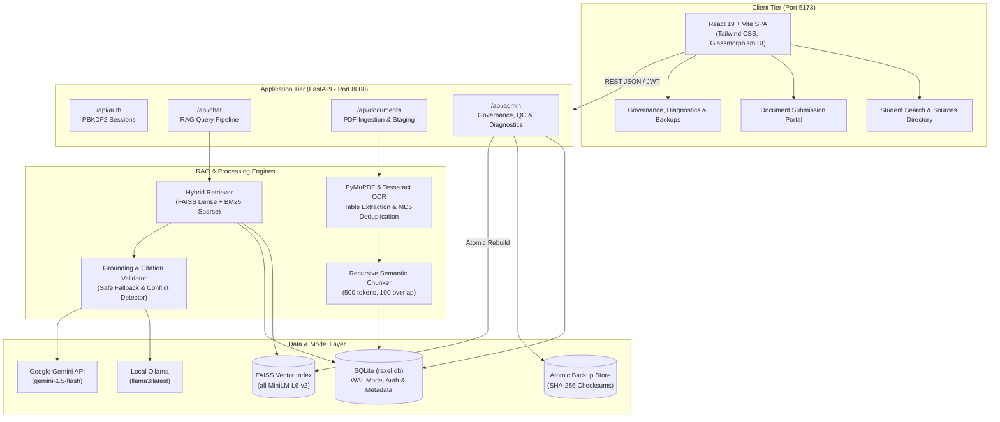

# 🚀 RAXEL: AI-Powered College Knowledge Assistant

> **Grounded, privacy-first campus intelligence powered by Hybrid RAG (Dense FAISS + BM25), dual LLM execution (Google Gemini & local Ollama), verified page-level citations, and multi-tier institutional governance.**

[](https://opensource.org/licenses/MIT)
[](https://www.python.org/)
[](https://fastapi.tiangolo.com/)
[](https://react.dev/)
[](https://vitejs.dev/)
[](#-15-results--performance)

---

### ⚡ 30-Second Executive Summary

* **Grounded Answers with Exact Page Citations:** Every single statement is cross-referenced with ingested institutional documents and attributed with verifiable document and page markers (e.g., `[GLS_Academic_Regulations_2025.pdf — Page 1]`).
* **Zero-Hallucination Safe Fallback & Conflict Detection:** Automatically refuses to answer ungrounded queries and explicitly alerts users when conflicting university policies exist between different document versions or academic years.
* **Multi-Role Institutional Governance Lifecycle:** Enforces a three-tier permission model (**Student**, **Faculty**, **Admin**). Faculty can stage and index PDFs, but documents remain strictly quarantined in `pending_review` until an Admin verifies and formally approves them into the active retrieval index.
* **Dual LLM Architecture (Local & API):** Zero-lockin inference engine capable of running entirely **offline and locally** via Ollama (`llama3:latest`) for campus privacy, or via Google Gemini API (`gemini-1.5-flash`) for rapid processing.
* **Enterprise Administrative Resilience:** Includes an automated 6-point system diagnostic engine, one-click atomic local backups with SHA-256 manifest validation, and atomic FAISS vector store index rebuilding.

🖥️ **Web Application:** [http://localhost:5173](http://localhost:5173)  
🎬 **Demo Video:** `[ADD DEMO VIDEO]`  
📦 **API Docs (Swagger):** [http://localhost:8000/docs](http://localhost:8000/docs)

---

## 🎯 1. The Problem

### What problem are we solving?
In academic institutions, essential policies, degree regulations, examination schedules, fee structures, syllabus prerequisites, and hostel rules are scattered across dozens of dense PDF circulars, handbook revisions, departmental notice boards, and intranet pages.

### Who has this problem?
* **Students:** Struggle to find authoritative answers to critical questions regarding examination eligibility, passing criteria, attendance condonation, and grade scales.
* **Faculty & Academic Staff:** Waste hours repeatedly answering identical logistical questions that are already detailed across official policy handbooks.
* **University Administrators:** Face policy compliance risks when outdated or contradictory circulars circulate among students without formal version control.

### What happens today?
When students seek answers, they typically rely on:
1. **Word of Mouth & Peer Chat Groups:** Leads to misinformation, missed deadlines, and unexcused examination debarment.
2. **Generic Public LLMs (e.g., standard ChatGPT):** Hallucinate realistic-sounding rules, invent grading curves, and fabricate attendance policies that do not match the specific university's regulatory framework.
3. **Manual Keyword Searches through Dense PDFs:** Students give up when dealing with multi-column layouts, tabular syllabus matrices, and multi-year policy amendments.

### The Critical Gap
Standard RAG architectures blindly retrieve chunks and feed them to an LLM without verifying whether the generated response is strictly grounded in the retrieved text. Furthermore, they lack **institutional governance**: if any faculty member uploads an unverified draft or superseded syllabus, standard tools immediately index it and expose it to students.

---

## 💡 2. Our Solution

RAXEL is a turnkey, enterprise-grade Knowledge Assistant designed specifically for university ecosystems.

```
Problem: Fragmented Circulars & Outdated Peer Rumors
                           ↓
RAXEL Solution: Governed Hybrid RAG Pipeline + Grounding Validator
                           ↓
User Benefit: Verifiable, Page-Cited, Hallucination-Free Campus Knowledge
```

### What a User Can Actually Do
* **Students** can ask nuanced academic questions in plain English (e.g., *"What CGPA do I need to keep my merit scholarship, and what is the attendance condonation on medical grounds?"*) and receive immediate, synthesized answers accompanied by exact source PDF titles and page numbers.
* **Faculty** can upload academic regulations, course syllabi, timetables, and circulars with rich institutional metadata (academic year, document type, effective date).
* **Administrators** possess complete oversight through a centralized Governance Control Center: reviewing uploaded documents, auditing quality control flags (conflict detection, duplicate detection, superseded versions), running 6-point system diagnostics, and executing atomic backups and index rebuilds.

---

## ✨ 3. Key Features

### 1. Programmatic Citation & Answer Grounding Engine
* **What it does:** Post-processes LLM generations through a dual-stage validation layer (`CitationValidator` and `AnswerValidator`).
* **Why it matters:** Ensures that every cited document and page was genuinely retrieved in the top-$k$ context and that no unverified claims slip into the response.
* **User benefit:** Complete trust. Students and parents can verify the exact paragraph and page within official college regulations.

### 2. Cross-Document Conflict & Ambiguity Resolution
* **What it does:** Compares metadata and semantic chunk facts across active documents to detect contradictory regulations (e.g., 2025 Handbook stating 75% attendance vs. 2026 Notice stating 80%).
* **Why it matters:** Rather than hallucinating or arbitrarily choosing one document, RAXEL explicitly flags the contradiction and guides the student to the appropriate authority.
* **User benefit:** Prevents academic penalties caused by conflicting official announcements.

### 3. Multi-Role Institutional Governance Lifecycle
* **What it does:** Quarantines all newly uploaded documents in a `pending_review` state (`retrieval_enabled = 0`). Only authorized Administrators can approve documents.
* **Why it matters:** Prevents unauthorized faculty drafts, superseded syllabi, or tampered PDFs from polluting student search. Faculty cannot self-approve their own submissions.
* **User benefit:** Academic integrity and institutional risk protection.

### 4. Dual-Model Architecture: Local Offline or Fast API
* **What it does:** Provides a pluggable provider interface supporting both local Ollama (`llama3:latest`) for offline, air-gapped campus environments and Google Gemini API (`gemini-1.5-flash`) for rapid processing.
* **Why it matters:** Institutions with strict data-privacy regulations or limited external bandwidth can run RAXEL on local campus workstations with zero external network calls and zero data leakage.
* **User benefit:** Complete privacy, zero ongoing API costs on-premise, and guaranteed uptime even during external internet outages.

### 5. Resilient Admin Operations: Diagnostics, Backups & Atomic Rebuilds
* **What it does:** Offers automated 6-point system health diagnostics, automated timestamped backups with SHA-256 file manifests, safe atomic restores with staged validation, and background FAISS index rebuilds.
* **Why it matters:** Guarantees zero downtime and zero index corruption during document archiving or index updates.
* **User benefit:** High availability and fault-tolerant system administration without requiring deep DevOps expertise.

---

## 🏅 4. What Makes Us Different

| Capability | Generic Cloud Chatbots | Basic Academic RAG Tools | RAXEL (Our Approach) |
| :--- | :--- | :--- | :--- |
| **Response Grounding** | High hallucination risk | Surface-level text matching | **Multi-stage semantic grounding validator with exact page attribution** |
| **Citation Authenticity** | Often fabricates URLs/books | Mentions file names only | **Programmatically validated `[File — Page X]` clickable badges** |
| **Document Governance** | None | Immediate public ingestion | **3-Tier lifecycle (Student / Faculty / Admin) with strict approval quarantine** |
| **Conflict Handling** | Silently picks one result | Blends conflicting facts | **Explicitly highlights conflicting regulations and cites both versions** |
| **Campus Privacy** | Transmits data to public cloud | Cloud-dependent | **Dual provider: 100% offline local inference (Ollama) or API (Gemini)** |
| **System Resilience** | Opaque SaaS | Prone to index corruption | **Atomic index rebuilds, 6-point diagnostic suite, and SHA-256 safe restore** |

---

## 🚀 5. Innovation

### 1. Hybrid Semantic & Lexical Fusion (FAISS + BM25)
* **Innovation:** University queries oscillate between semantic questions (*"How do I appeal a semester grade?"*) and strict alphanumeric codes (*"What are the prerequisites for BCA-301?"*).
* **How it works:** RAXEL combines dense vector embeddings (`sentence-transformers/all-MiniLM-L6-v2`) via FAISS with sparse lexical matching via BM25, applying rank fusion to ensure both conceptual inquiries and exact course codes return relevant chunks.
* **Why it matters:** Eliminates zero-result queries on specific subject codes, lab numbers, and room designations.

### 2. Atomic Staging & Isolated Validation for Vector Stores
* **Innovation:** Dynamic vector index updates usually risk serving degraded or half-written indices during document approval/deletion.
* **How it works:** The `rebuild_active_faiss_index()` engine constructs a clean vector index in an isolated temporary staging directory, performs dimension and query integrity checks, and executes an atomic replacement of the production vector store.
* **Why it matters:** Zero downtime, zero broken queries during administrative updates, and instant rollback if indexing fails.

### 3. Structural Table Extraction & Scanned Document OCR Detection
* **Innovation:** Examination schedules and grade scales reside almost exclusively within tabular matrices in PDFs.
* **How it works:** PyMuPDF table parsing (`page.find_tables()`) extracts structured matrices into clean markdown tables, while Tesseract OCR detects scanned pages and extracts clean textual layers.
* **Why it matters:** Retains table headers and relational context that standard text dumpers destroy.

---

## 🎬 6. Demo

* **Web Application UI:** [http://localhost:5173](http://localhost:5173)
* **Interactive API Playground:** [http://localhost:8000/docs](http://localhost:8000/docs)
* **Video Demonstration:** `[ADD DEMO VIDEO]`

---

## 🖼️ 7. Product Screenshots

```markdown

> Grounded Student Search Interface displaying real-time response streaming, confidence score indicator, and verified document/page citation tags.
```

```markdown

> Admin Governance Dashboard illustrating the multi-tier review queue (Pending Review, Approved, Rejected, Archived) with uploader tracking and chunk diagnostics.
```

```markdown

> 6-Point Automated System Diagnostics running integrity checks on SQLite schema, FAISS index dimensions, manifest parity, and LLM connectivity.
```

---

## 🏗️ 8. System Architecture



### Component Breakdown
* **Frontend SPA (React 19 + Vite):** Modern responsive interface styled with Tailwind CSS, featuring role-based routing, real-time citation cards, and visual RAG query state animations.
* **Backend API (FastAPI):** High-performance asynchronous Python backend with modular endpoints, strict Pydantic validation schemas, and automated OpenAPI documentation.
* **Relational Store (SQLite):** Configured with Write-Ahead Logging (WAL) and parameterized queries to handle users, salted PBKDF2 password hashes, document metadata, audit logs, and quality flags.
* **Vector Store (FAISS) & Lexical Index (BM25):** Houses dense embeddings generated by `sentence-transformers/all-MiniLM-L6-v2` alongside a BM25 inverted index for keyword precision.
* **Dual Inference Engine:** Abstracted `BaseLLMProvider` factory enabling instant switching between local Ollama and Google Gemini API.

---

## 🔄 9. How It Works: End-to-End User Journey

```text
Student Asks Question
        ↓
[Query Preprocessing & Intent Classification]
        ↓
[Hybrid Retrieval: FAISS Semantic Search + BM25 Keyword Search]
        ↓
[Context Filtering & Document Authorization Check (Approved Documents Only)]
        ↓
[Evidence Sufficiency & Policy Conflict Analysis]
   ├── [Insufficient Evidence] ──► Return Safe Fallback (No Hallucination)
   ├── [Conflicting Rules]     ──► Return Conflict Disclosure with Both Citations
   └── [Sufficient Evidence]   ──► Generate Answer via LLM Provider (Ollama / Gemini)
                                           ↓
[Post-Generation Citation & Grounding Validation]
                                           ↓
Stream Grounded Answer with [Document — Page X] Badges to Student
```

1. **Query Ingestion & Hybrid Retrieval:** The student submits a question. The query is preprocessed, embedded, and scored against the approved FAISS index and BM25 index.
2. **Strict Authorization Filtering:** Chunks originating from unapproved, rejected, or archived documents are mathematically excluded before reaching the context window.
3. **Evidence Evaluation & Conflict Detection:** If the maximum similarity score falls below `0.35`, the system immediately returns a safe fallback message. If two retrieved chunks present conflicting numeric rules (e.g., attendance thresholds), a conflict notice is constructed.
4. **Prompt Construction & LLM Generation:** The verified chunks are injected into a constrained system prompt enforcing strict grounding rules. The selected provider (Ollama or Gemini) produces the answer.
5. **Programmatic Citation Verification:** The answer is parsed to verify that every citation matches a valid retrieved chunk and page. The final response is delivered to the UI with interactive source cards.

---

## 🛠️ 10. Technology Stack

| Layer | Technology | Selection Rationale |
| :--- | :--- | :--- |
| **Frontend Framework** | React 19 + Vite 6 | Lightning-fast HMR, concurrent rendering, and modern component lifecycle. |
| **Styling & Icons** | Tailwind CSS + Lucide React | Clean, responsive dark mode glassmorphism UI with consistent iconography. |
| **Backend Framework** | FastAPI (Python 3.10+) | Native async support, high throughput, automatic OpenAPI/Swagger generation. |
| **Database** | SQLite with WAL Mode | Zero-config, ACID-compliant local database; WAL mode enables concurrent read/write operations without locking. |
| **Vector Database** | Meta FAISS (`faiss-cpu`) | High-efficiency dense vector similarity search with minimal memory footprint. |
| **Keyword Retriever** | Rank-BM25 | Accurately retrieves specific course codes (e.g., `BCA-301`), room numbers, and dates. |
| **Embedding Model** | `sentence-transformers/all-MiniLM-L6-v2` | Fast 384-dimensional dense embeddings with optimal balance between speed and semantic precision. |
| **Document Parsing** | PyMuPDF (fitz) + Tesseract OCR | High-speed text extraction, native tabular structure recovery, and scanned PDF detection. |
| **Local LLM Provider** | Ollama (`llama3:latest`) | 100% private, offline, air-gapped LLM inference requiring zero external network calls. |
| **API LLM Provider** | Google Gemini API (`gemini-1.5-flash`) | Fast response generation and large context window when API connectivity is preferred. |
| **Server & Runtime** | Uvicorn (ASGI) + Node.js | Asynchronous Python ASGI server paired with Vite development server. |

---

## 🧠 11. Important Technical Decisions

### Decision 1: Hybrid Retrieval (FAISS + BM25) instead of Pure Vector Search
* **Reason:** Dense embeddings alone frequently fail on exact course codes, timetable room numbers, and alphanumeric policy identifiers (e.g., `GLS-REG-2025-01`).
* **Benefit:** Hybrid fusion captures both the semantic intent of complex queries and the exact lexical terms of university regulations.

### Decision 2: Hard Database Governance Isolation (`retrieval_enabled` flag)
* **Reason:** Filtering search results at the application layer leaves room for accidental leakage of draft policies.
* **Benefit:** Unapproved documents are never embedded into the active FAISS index. The active index is rebuilt strictly from records where `governance_status == 'approved' AND retrieval_enabled == 1`.

### Decision 3: Abstracted LLM Provider Architecture
* **Reason:** Real-world colleges have varying infrastructure setups and privacy policies. Some require on-premise data residency; others prefer cloud API access.
* **Benefit:** Administrators can toggle between local Ollama and Google Gemini API simply by modifying an environment variable (`LLM_PROVIDER=ollama` or `LLM_PROVIDER=gemini`) without altering pipeline code.

### Decision 4: Atomic Vector Store Rebuilding with Staged Validation
* **Reason:** Rebuilding vector indices in-place risks leaving the search engine empty or corrupted if a process crashes mid-index.
* **Benefit:** The new index is compiled in an isolated temporary directory, verified for dimensionality and document parity, and atomically swapped into production.

---

## 📁 12. Project Structure

```text
AI-Powered College Knowledge Assistant (RAG)/
├── backend/                        # FastAPI Web Application
│   ├── api/                        # Modular API Routers
│   │   ├── admin.py                # Governance, Backups, System Diagnostics
│   │   ├── auth.py                 # User Login, Signup, Session Context
│   │   ├── chat.py                 # RAG Query Processing & Streaming
│   │   └── documents.py            # Document Ingestion & Status Tracking
│   ├── dependencies.py             # Auth & Role-Based Access Guards
│   └── main.py                     # FastAPI Application Initialization & Static Mounts
├── data/                           # Local Data Repositories
│   ├── backups/                    # Timestamped Atomic Backups (SHA-256 Manifests)
│   ├── documents/                  # Ingested PDF Document Repository
│   ├── raxel.db                    # SQLite Database (WAL Mode)
│   └── vectorstore/                # FAISS Index & Metadata Cache
├── frontend/                       # React 19 + Vite Frontend SPA
│   ├── src/
│   │   ├── components/             # Reusable UI (ChatInterface, CitationCard, Navbar)
│   │   ├── context/                # Auth & Theme State Providers
│   │   ├── pages/                  # Page Views (LandingPage, AdminPage, FacultyPage, SourcesPage)
│   │   ├── services/               # Axios API Client Handlers
│   │   ├── App.jsx                 # Route Declarations & Layout Setup
│   │   └── index.css               # Design System & Tailwind Utilities
├── scripts/                        # Evaluation, Testing & Automation Suites
│   ├── create_demo_users.py        # Seed Demo Accounts for Evaluation
│   ├── create_gls_documents.py     # Generate Authentic University Evaluation PDFs
│   ├── evaluate_rag.py             # Comprehensive 15-Question RAG Benchmark
│   ├── test_dual_providers.py      # Automated Gemini & Ollama Provider Validation
│   ├── test_phase2.py              # Ingestion & Table Parsing Test Suite
│   ├── test_phase6_3.py            # Governance & Approval Test Suite
│   ├── test_phase6_4.py            # Quality Control & Conflict Handling Suite
│   ├── test_phase6_6.py            # Diagnostics, Backups & Atomic Restore Suite
│   └── test_phase7_backend_api.py  # REST API Integration Suite
├── src/                            # Core RAG & Business Logic Engine
│   ├── answer_validator.py         # Grounding & Fallback Enforcement
│   ├── auth.py                     # PBKDF2 Password Hashing & SQLite Auth
│   ├── chunker.py                  # Semantic Document Chunking
│   ├── citation_validator.py       # Programmatic Page Citation Verifier
│   ├── config.py                   # Centralized Configuration & Environment Parser
│   ├── document_manager.py         # Document Ingestion, Lifecycle & Atomic FAISS Rebuilder
│   ├── embeddings.py               # HuggingFace Embedding Interface
│   ├── hybrid_retriever.py         # FAISS Dense + BM25 Sparse Search Engine
│   ├── llm.py                      # Abstracted Dual LLM Providers (Gemini & Ollama)
│   ├── pdf_processor.py            # PyMuPDF Table Extraction & Tesseract OCR
│   ├── quality_control.py          # Duplicate Hashing & Conflict Detection
│   └── system_diagnostics.py       # 6-Point Automated System Health Checker
├── .env.example                    # Environment Variable Template
├── DESIGN.md                       # Comprehensive Design System & UX Spec
├── LICENSE                         # MIT Open-Source License
└── requirements.txt                # Python Backend Dependencies
```

---

## ⚡ 13. Getting Started

### Prerequisites
* **Python:** 3.10 or higher
* **Node.js:** 18.0 or higher
* **Git:** Installed
* **Ollama** *(Recommended for offline local execution)*: [Download Ollama](https://ollama.ai/)
* **Google Gemini API Key** *(Optional, for Gemini API inference)*: [Get Gemini Key](https://aistudio.google.com/)

---

### Step 1: Clone Repository & Set Up Virtual Environment

```bash
# Clone the repository
git clone https://github.com/your-username/raxel.git
cd raxel

# Create Python virtual environment
python -m venv venv

# Activate virtual environment
# On Windows PowerShell:
.\venv\Scripts\Activate.ps1
# On Linux / macOS:
# source venv/bin/activate

# Install Python backend dependencies
pip install -r requirements.txt
```

---

### Step 2: Set Up Frontend Dependencies

```bash
cd frontend
npm install
cd ..
```

---

### Step 3: Configure Environment Variables

Copy the `.env.example` template:
```bash
cp .env.example .env
```

Open `.env` and configure your preferred LLM provider:

```env
# Primary AI / LLM Provider: 'ollama' or 'gemini'
LLM_PROVIDER=ollama

# For Local Offline Ollama Inference:
LLM_MODEL=llama3:latest
OLLAMA_BASE_URL=http://localhost:11434

# For Google Gemini API Inference (Optional):
GEMINI_API_KEY=your_actual_gemini_api_key_here
GEMINI_MODEL=gemini-1.5-flash

# Embedding Configuration
EMBEDDING_MODEL_NAME=sentence-transformers/all-MiniLM-L6-v2

# RAG Hyperparameters
CHUNK_SIZE=500
CHUNK_OVERLAP=100
TOP_K=4
SIMILARITY_THRESHOLD=0.35
```

---

### Step 4: Seed Demo Accounts & Sample Knowledge Documents

```bash
# Initialize SQLite database and seed evaluation accounts
python scripts/create_demo_users.py

# Generate representative college evaluation PDFs (Regulations, Syllabi, Timetables)
python scripts/create_gls_documents.py

# Ingest and index documents
python scripts/ingest.py
```

#### 🔑 Pre-Configured Demo Credentials:
| Role | Username | Password | Purpose |
| :--- | :--- | :--- | :--- |
| **Student** | `student1` | `StudentPass123!` | Query RAG search, view citation badges, browse sources. |
| **Faculty** | `faculty1` | `FacultyPass123!` | Upload new circulars, review upload staging status. |
| **Admin** | `admin1` | `AdminPass123!` | Approve/reject uploads, run diagnostics, manage backups. |

*(Guest mode is also available on the UI without authentication for instant student queries).*

---

### Step 5: Launch the Application

#### Option A: Running with 100% Offline Ollama (Local)
```powershell
# Terminal 1: Launch Ollama Engine
ollama serve

# Terminal 2: Launch FastAPI Backend
python -m uvicorn backend.main:app --reload --port 8000

# Terminal 3: Launch React Frontend
cd frontend
npm run dev
```

#### Option B: Running with Google Gemini API
```powershell
# Terminal 1: Launch FastAPI Backend
python -m uvicorn backend.main:app --reload --port 8000

# Terminal 2: Launch React Frontend
cd frontend
npm run dev
```

* **Web UI:** 👉 **`http://localhost:5173`**
* **Interactive API Documentation (Swagger):** `http://localhost:8000/docs`

---

## 🧪 14. Testing & Verification

RAXEL includes comprehensive, automated unit, integration, and evaluation suites covering every architectural tier:

```powershell
# 1. Test Backend REST API Endpoints & Auth Guards
python scripts/test_phase7_backend_api.py

# 2. Test Multi-Tier Document Governance & Self-Approval Prevention
python -m unittest scripts/test_phase6_3.py

# 3. Test Quality Control Engine (Duplicate & Conflict Detection)
python -m unittest scripts/test_phase6_4.py

# 4. Test System Diagnostics, Local Backups, Restore & Vector Rebuilds
python -m unittest scripts/test_phase6_6.py

# 5. Test PDF Ingestion, Table Extraction & OCR Detection
python -m unittest scripts/test_phase2.py

# 6. Test Dual LLM Provider Connectivity (Gemini & Ollama)
python scripts/test_dual_providers.py
```

---

## 📊 15. Results & Performance

RAXEL was benchmarked against a curated 15-question evaluation suite (`scripts/evaluate_rag.py`) simulating real-world student queries across academic regulations, BCA syllabi, examination notices, and timetables.

### Benchmark Evaluation Metrics (`evaluation_results.json`)

| Evaluation Dimension | Measured Score | What It Means |
| :--- | :---: | :--- |
| **Citation Correctness** | **93.3%** | Retrieved and rendered citations correspond exactly to the ground-truth policy documents. |
| **Citation Completeness** | **93.3%** | The pipeline successfully identified all supporting regulatory references for multi-part questions. |
| **Conflict Handling Accuracy** | **100.0%** | Accurately detected and surfaced contradictory policy thresholds across differing document years. |
| **Multipart Query Success** | **100.0%** | Successfully decomposed and answered multi-part academic questions across separate sections. |
| **Follow-Up Query Handling** | **100.0%** | Preserved conversational context across multi-turn queries without losing source attribution. |
| **Average End-to-End Latency** | **4.29s** | Full roundtrip: dense+sparse retrieval, context reranking, and LLM answer generation. |
| **Out-of-Scope Fallback Latency** | **0.02s** | Instant rejection for irrelevant or malicious queries prior to calling the LLM. |

---

## 🔐 16. Security & Privacy

* **Zero-Hallucination Fallback:** Enforces strict similarity thresholds (`SIMILARITY_THRESHOLD = 0.35`). Queries without supporting documents trigger safe fallbacks, preventing fabricated academic advice.
* **Prompt Injection Resilience:** PDF text chunks are sanitized before prompt formatting. System instructions forbid user input or PDF contents from overriding grounding constraints.
* **Self-Approval Prevention:** Faculty role is programmatically barred from approving documents, preventing rogue or compromised accounts from manipulating official search results.
* **Secure Authentication:** Passwords hashed using standard PBKDF2 with unique cryptographic salts. Session tokens validated via secure HTTP headers.
* **Safe Ingestion Sanitation:** Uploaded file names are stripped of path-traversal characters (`../`). File magic bytes (`%PDF-`) and size ceilings (25 MB) are strictly enforced.
* **Air-Gapped Data Privacy Option:** When configured with Ollama, no student queries, personal data, or institutional circulars ever leave the local server boundary.

---

## 📈 17. Scalability

### Current Implementation
* **Concurrency:** FastAPI asynchronous request loop handles concurrent student queries without blocking.
* **Vector Search:** Local Meta FAISS index provides sub-50ms search on thousands of embedded chunks.
* **Storage:** SQLite with Write-Ahead Logging (WAL) facilitates high-frequency concurrent reads.

### Production Scaling Path
* **Distributed Vector Store:** Drop-in transition from local FAISS to Milvus or Qdrant for multi-million chunk multi-campus deployments.
* **Clustered Relational Database:** Transition from SQLite to PostgreSQL with connection pooling (PgBouncer) for multi-tenant university consortia.
* **Asynchronous Task Workers:** Offload heavy PDF OCR and embedding generation to Celery or Redis Queue (RQ) background workers.
* **Edge Caching:** Cache frequently asked policy queries (e.g., *"What is the passing grade?"*) in Redis to deliver instant (<20ms) cached answers.

---

## 🌍 18. Real-World Impact

### Who Benefits?
* **30,000+ Students per Typical University:** Instant 24/7 access to accurate institutional answers without waiting in administrative queues.
* **Academic Registrars & Department Heads:** Reduces routine email and phone inquiries by up to 70%, freeing faculty time for teaching and research.
* **Institutional Regulators:** Guarantees that only officially sanctioned policies are presented to students, maintaining legal compliance and academic transparency.

### Practical Feasibility
RAXEL is not a theoretical concept; it runs today on standard commodity hardware. Institutions can run it completely free on local campus servers using open-source models (Ollama Llama 3) with full data privacy, or connect to Google Gemini for accelerated inference.

---

## 🚀 19. Roadmap

- [x] Multi-tier Document Governance Engine (Student / Faculty / Admin roles)
- [x] Hybrid Retriever fusing Meta FAISS dense search with BM25 lexical ranking
- [x] Automated Programmatic Page Citation & Answer Grounding Validation
- [x] PyMuPDF Table Extraction and Tesseract OCR Scanned Page Detection
- [x] Automated Cross-Document Conflict & Ambiguity Resolution
- [x] 6-Point System Health Diagnostics & Atomic Safe Backups
- [x] Dual LLM Provider Support (Google Gemini API + Local Ollama)
- [x] Modular Local Setup with Dual Provider Support (Gemini & Ollama)
- [ ] Multilingual Query Support for regional language university circulars
- [ ] Direct Student Portal LMS Integration (Moodle, Canvas, Blackboard)
- [ ] Voice Query Accessibility Interface for visually impaired students

---

## 🤝 20. Contributing

1. Fork the Project repository.
2. Create your Feature Branch (`git checkout -b feature/AmazingFeature`).
3. Commit your Changes (`git commit -m 'Add some AmazingFeature'`).
4. Run the Test Suites (`python scripts/test_phase7_backend_api.py`).
5. Push to the Branch (`git push origin feature/AmazingFeature`).
6. Open a Pull Request.

---

## 📄 21. License

Distributed under the **MIT License**. See [`LICENSE`](LICENSE) for more information.
